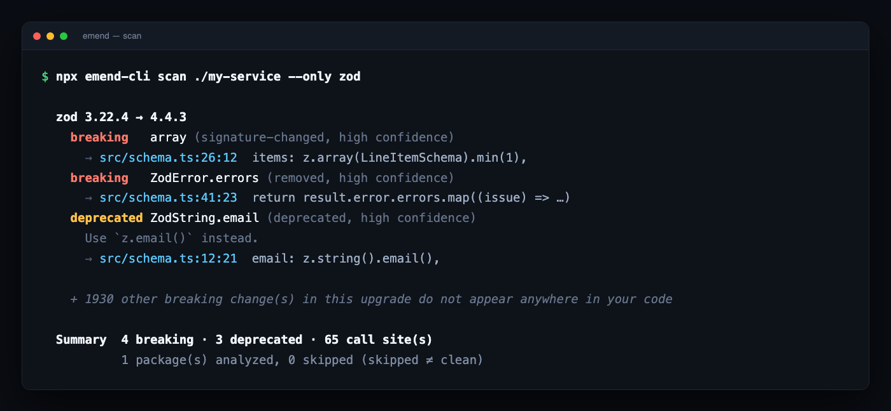

<div align="center">

# Emend

**Verified AI migrations for dependency upgrades.**

Emend finds which of *your* lines a version bump actually breaks, migrates them with an
agent in a throwaway worktree, then proves the result compiles and your tests still
pass — or refuses to call it fixed.

[](https://www.npmjs.com/package/emend-cli)
[](https://github.com/diyanbogdanov/emend/actions/workflows/ci.yml)
[](https://nodejs.org)
[](./LICENSE)

</div>



**That "+ 1930" line is the product.** zod 4 ships 1,934 breaking changes. Four of them
touch this repository. Everything downstream operates on those four — and on the line
below the summary, which says how much of the repository went *unexamined*, because a
summary that cannot be wrong about its own coverage is the only kind worth reading.

---

## Try it in 30 seconds

No API key. No config. `scan` is fully deterministic and never calls a model.

```bash
npx emend-cli@latest demo ./emend-demo
```

```bash
npx emend-cli@latest scan ./emend-demo --only zod
```

That scaffolds a repo with genuine dependency drift and shows you exactly the output
above. Requires **Node 22.6+**.

Then point it at something real:

```bash
npx emend-cli@latest scan . --only zod,axios
```

---

## Why this isn't another AI migration tool

Most tools in this category end at "the model edited your files." Emend treats that as
the *start* of the problem, because a model that edits confidently and wrongly is worse
than one that does nothing.

**Every migration runs in a throwaway `git worktree`:**

1. **baseline** — typecheck + tests run *before* any edit
2. apply the edits, bump the dependency
3. **post** — typecheck + tests run again, and the two are compared

Without step 1, a repository that was already failing has its pre-existing failures
blamed on the migration. Emend distinguishes `verified` / `regression` /
`pre-existing-failure` / `typecheck-only` / `unverified`, and **never reports the last
three as success.** Nothing touches your working tree; the worktree is thrown away
unless it verifies.

A second pass — a read-only behaviour review — then answers what a green build cannot:
whether the change still *means* the same thing. Its own edits are re-verified, and
reverted wholesale if they don't hold.

### Honesty rules, enforced in code

Not conventions. These are properties the test suite holds to:

- A package with no type declarations is **`unanalyzable`**, never "clean".
- A truncated surface walk **suppresses removal reporting** — absence past a cutoff is not deletion.
- Verification that didn't run is **`unverified`**, never "passing".
- No test script means **`typecheck-only`**, never "tests pass".
- Breaking changes detected but *not* located in your code are **counted and reported**, not silently dropped — static analysis cannot see `client[name]()`.
- Skipped packages are counted separately from analyzed ones. **Skipped ≠ clean.**
- A run that cannot reach a model **repairs nothing and says so.** *Could not fix is not the same as nothing to fix.*

---

## How it works

```
  package.json + node_modules              npm registry
            │                                    │
            ▼                                    ▼
      installed version  ────────────►  .d.ts of BOTH versions
                                                 │
                                                 ▼
                                       public API surface diff
                                    (removed / signature / deprecated)
                                                 │
   TypeScript program over your repo             │
   (imports + type-checker resolution)           │
            │                                    │
            └──────────────► INTERSECTION ◄──────┘
                                  │
                                  ▼
                              FINDINGS  (symbol, file:line, severity)
                                  │
             ┌────────────────────┼────────────────────┐
             ▼                    ▼                    ▼
     deterministic plan    harness (opencode+MCP)  dashboard / PR
             └──────────► isolated git worktree ◄──────┘
                                  │
                    baseline → apply → verify → compare
                                  │
                                  ▼
                    behaviour review (read-only model)
                                  │
                                  ▼
             verified · regression · unverified · unreviewed
```

**Why `.d.ts` diffing.** Other approaches read version numbers (no idea what changed),
OpenAPI specs (most SDK surface isn't in them), or changelogs (prose, and frequently
silent about breaks). Type declarations are machine-readable, versioned, exhaustive, and
**already published** by nearly every TypeScript SDK — no provider cooperation required.

**Why the intersection matters.** A diff alone is noise. Crossing it with real call sites
turns "1,934 breaking changes" into a four-item work order with file and line numbers.

The deterministic core — detection, localisation, rename-class migrations, verification —
runs with **no model involved**. The model runs only where the answer is a judgement.
Full design in **[docs/architecture.md](docs/architecture.md)**.

---

## What it checks

| Tier | What it reads | Command |
| --- | --- | --- |
| **Typed packages** | Published `.d.ts` of both versions, crossed with your call sites | `emend scan <repo>` |
| **HTTP contracts** | Each vendor's *own* published OpenAPI description, vs. your outbound calls | `emend scan <repo> --contracts` |
| **Version pins** | Lockfile vs. the copies in Dockerfiles, CI matrices, `.nvmrc` | `emend pins <repo>` |
| **Vulnerabilities** | The installed tree against OSV — no key, no rate limit | `emend scan <repo> --vulns` |

### Calls to APIs you don't have a package for

Half the contracts a service depends on aren't packages at all:

```ts
const res = await fetch(`https://api.vendor.com/v1/audiences/${id}/contacts`);
```

No `.d.ts`, no lockfile entry, no type — a URL is a string that compiles whatever it
says. `--contracts` resolves each vendor's own OpenAPI description and reports calls
reaching a route the description no longer contains, guarded by **provenance** (is this
really the vendor speaking?), **currency** (a first-party spec last touched in 2020
asserts nothing), and **coverage** (one host often serves several APIs).

A finding here is **a lead to verify, not a proof** — providers do serve endpoints they
never wrote down, which is why it says *not described by* rather than *removed*. See
[docs/limitations.md](docs/limitations.md).

### Versions your repo writes down twice

A version lives in the lockfile, where the package manager keeps it honest. The same
version copied into a Docker tag, an `.nvmrc`, or a CI matrix is a copy, and nothing
keeps a copy honest.

```
$ emend pins ./my-service

  drift      node → 22 (the declared engines.node)
    → Dockerfile:1  node:18-alpine
    → .github/workflows/ci.yml:6  node-version: '22'

  VERIFIED  2 edit(s) applied of 1 repairable conflict(s)
```

Three files declaring three versions with nothing to arbitrate are reported as
disagreeing and **not** repaired — picking a winner would be guessing, and that decision
is yours.

---

## Commands

| Command | What it does |
| --- | --- |
| `emend demo [dir]` | Scaffold a demo repo with real drift |
| `emend scan <repo>` | Find API changes that intersect your code |
| `emend fix <repo>` | Plan, apply, and verify migrations |
| `emend pr <repo> --finding <id>` | Render the pull request (dry run by default) |
| `emend pins <repo>` | Repair drifted version pins — no model involved |
| `emend eval` | Measure the agent against a corpus |
| `emend serve` | Local dashboard, or a hosted monitor with GitHub App credentials |
| `emend models` | List models your LLM provider serves |
| `emend store list` | What is stored locally |
| `emend mcp` | Serve Emend's tools over MCP, so a coding agent can drive it |

Useful flags: `--only pkg,pkg`, `--all`, `--json`, `--no-dev`, `--contracts`,
`--features`, `--freshness`, `--vulns`, `--lint` (scan); `--finding <id>`, `--no-agent`,
`--no-review`, `--untrusted`, `--keep` (fix). `emend --help` has the full list.

**`emend mcp`** exposes seven tools — `scan`, `plan_remediation`, `fix_vulnerability`,
`fix_package`, `verify`, `advisory_status`, `impact` — and every one returns what was
*measured*, never a judgement. An agent claiming a vulnerability is fixed has to call
`advisory_status` and read the lockfile's answer.

---

## Repairing, not just scanning

`scan` needs nothing. **Repairing** additionally needs the
[`opencode`](https://opencode.ai) binary on your `PATH` and a key for a model it can
reach. Emend's reviews and PR summaries work with **any OpenAI-compatible endpoint**:

```bash
export EMEND_LLM_PROVIDER=nebius     # or fireworks, together, groq,
                                     # deepinfra, openrouter, ollama, vllm
export NEBIUS_API_KEY=...
emend models                         # see what your provider serves today
export EMEND_LLM_MODEL=<id from above>

emend fix ./my-service
```

Or point it anywhere directly — a local Ollama works:

```bash
export EMEND_LLM_BASE_URL=http://localhost:11434/v1
export EMEND_LLM_MODEL=qwen3-coder:30b
```

The recommended defaults are open-weight. This follows the literature rather than the
intuition: Byam (arXiv 2505.07522) found end-to-end LLM migration fully repaired only
**27%** of builds, improving markedly when given API diffs, failing lines and compiler
feedback — all of which the harness is given. BigBag (arXiv 2606.24446) drives its agent
through a harness for **78.6%**.

Prompt changes are cheap to make and hard to judge, so there's a scored corpus:
[docs/evaluating-the-agent.md](docs/evaluating-the-agent.md).

---

## Can I use this at work?

**Yes — running Emend on your own code triggers no obligations at all.**

Emend is AGPL-3.0. The clause people are usually worried about is **§13, Remote Network
Interaction**, and it is narrower than its reputation:

| What you're doing | What you owe |
| --- | --- |
| Running `emend scan` / `fix` on your own repositories | **Nothing.** |
| Running it in your own CI, on private code | **Nothing.** |
| Modifying it for internal use | **Nothing**, as long as it stays internal. |
| Running a **modified** Emend as a service *for other people* | Offer those users your modified source. |
| Embedding it in a product you ship without AGPL terms | Get a commercial licence. |

AGPL is a copyleft on *distribution and network service*, not on the code it reads. Emend
analysing your repository no more licences your repository than `tsc` does.

A separate **commercial licence** is available for embedding Emend without AGPL
obligations — reach out via [issues](https://github.com/diyanbogdanov/emend/issues). That
option only exists because contributions are collected under a [CLA](./CLA.md); see
[CONTRIBUTING.md](./CONTRIBUTING.md) for why it's collected before the first merge rather
than after.

---

## Running it as a service

`emend serve` is a local dashboard, and becomes a hosted monitor when GitHub App
credentials are present:

```bash
export EMEND_GITHUB_APP_ID=...
export EMEND_GITHUB_PRIVATE_KEY="$(cat emend.private-key.pem)"
export EMEND_GITHUB_WEBHOOK_SECRET=...

emend serve --port 8080 --host 0.0.0.0     # POST /webhook is now live
```

Installing it on a repository queues a scan; pushes to the default branch queue another.
Each scan reconstructs `node_modules` from the lockfile, finds the drift, migrates what
it can, and opens a **draft** pull request per package.

**Why it can run untrusted repositories in-process:** analysis never executes anything
from the repository or its dependency tree. Dependencies are symlinked from a tarball
cache rather than installed, the bump passes `--ignore-scripts`, and the repository's
test script is never invoked. The cost is that hosted verification is **typecheck-only** —
Emend says so on the pull request rather than implying more, and reads the real verdict
back from the `check_suite` webhook when your CI runs the tests.

Step-by-step: [docs/github-app-setup.md](docs/github-app-setup.md) ·
[docs/deployment.md](docs/deployment.md)

---

## Status

**MVP / proof of concept.** TypeScript + npm + GitHub only. Scanning, migration and pull
requests are exercised against a real private repository; the GitHub App token exchange
is the one link only a registered App can validate.

Emend is deliberately explicit about where it can be wrong or silent —
**[docs/limitations.md](docs/limitations.md)** documents each case, measured rather than
hypothesised. If you only read one other page, read that one.

Issues and PRs welcome — [CONTRIBUTING.md](./CONTRIBUTING.md) has the ground rules
(`npm run typecheck` and `npm test` must be green; prompt changes need an `emend eval`
table before and after).

---

## Docs

| | |
| --- | --- |
| [Getting started](docs/getting-started.md) | Configure a model, scan a real repository, read the output |
| [Architecture](docs/architecture.md) | The three tiers of evidence, and where the model deliberately does not participate |
| [Known limitations](docs/limitations.md) | Every case where Emend can be wrong or silent, measured |
| [Evaluating the agent](docs/evaluating-the-agent.md) | The scored corpus, and why `Pass` and `Clean` are different columns |
| [GitHub App setup](docs/github-app-setup.md) | Registering the App, step by step |
| [Deployment](docs/deployment.md) | Sizing, hosting, systemd/TLS |

Build from source:

```bash
git clone https://github.com/diyanbogdanov/emend.git && cd emend && npm install
npm run typecheck && npm test
```

A checkout runs its sources directly via native type stripping — no build step needed.

---

## Licence

Copyright © 2026 Diyan Bogdanov. **AGPL-3.0-only** — see [LICENSE](./LICENSE) and
[Can I use this at work?](#can-i-use-this-at-work) above. Third-party material is listed
in [THIRD-PARTY-NOTICES.md](./THIRD-PARTY-NOTICES.md).
